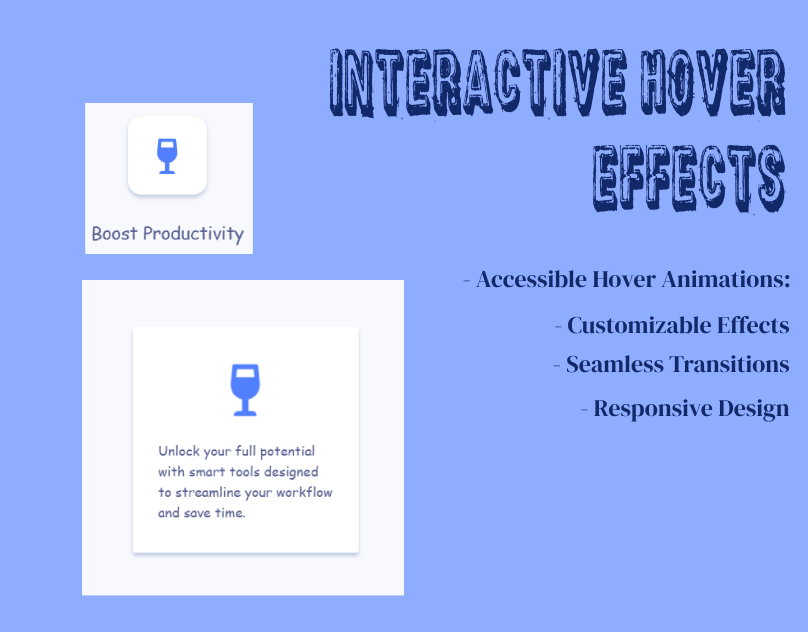

# Interactive Hover Effects | Accessible Card Animations

### Author
##### Virendra D. Verma

<a href="https://www.linkedin.com/in/dharmendraverma95/" target="_blank">LinkedIn Profile </a>

<a href="https://www.behance.net/dhirukumar" target="_blank">Behance Profile </a>

# Project Overview
This project provides smooth and accessible hover animations for enhancing card sections on your website. The animations are designed to improve user engagement and provide an intuitive experience. With seamless interactions, users can easily navigate and interact with the cards on the site.

## Features
- Accessible Hover Animations: Built with web accessibility in mind, ensuring smooth hover effects for all users.
- Customizable Effects: Easily modify the animations to suit the theme and style of your website.
- Seamless Transitions: Smooth transitions make for a polished user experience.
- Responsive Design: Fully responsive and works well across various devices.

# Preview
Interactive Hover Effects Card Design Section
 

 
Interactive Hover Effects Card Design Section Start & End Point 
 

 
Interactive Hover Effects Card Design Section UI UX Layout Start & End Point
 

 
Interactive Hover Effects Card Design Section UI UX Layout
 

 
Cover
 

 

### Technologies Used
<ul>
  <li>Graphic Design Software: Photoshop, Figma (for mockups)</li>
  <li>Web Tools (Optional): HTML5, CSS3 for any digital presentations or landing pages</li>
</ul>